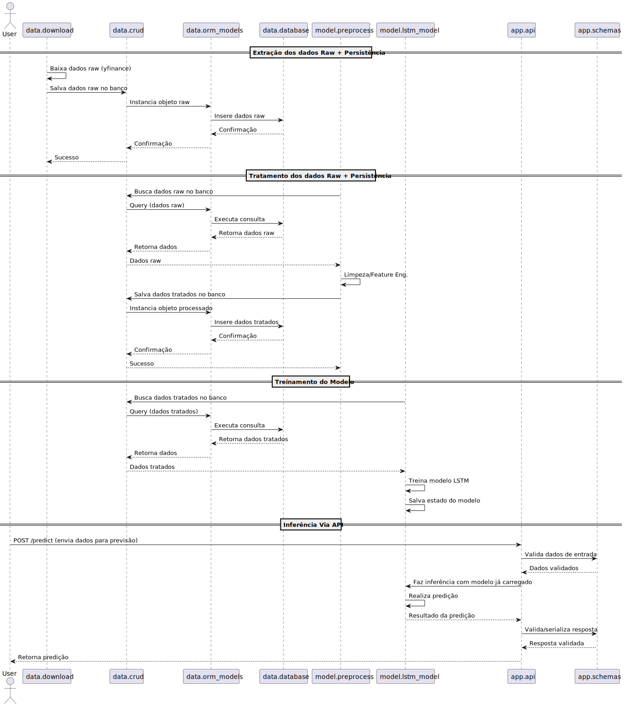

## Projeto: Pipeline de Predição de Ações com LSTM, API e Banco de Dados

### Abstract

Este projeto propõe o desenvolvimento de uma solução completa para previsão de preços de fechamento de ações utilizando redes LSTM. A aplicação cobre todas as etapas do ciclo de vida de projetos de machine learning: coleta, pré-processamento, armazenamento, treinamento, deploy em API e integração com banco de dados, sempre com foco em alta coesão e baixo acoplamento entre as camadas.
* * *

### Índice Temático

*   [[#Critérios do Projeto e Responsabilidades das Camadas]]
    
*   [[#Diagrama de Sequência da Arquitetura PlantUML]]
    
*   [[#Estrutura Visual do Projeto (Árvore)]]
    
*   [[#Resumo dos Principais Pontos da Estrutura]]
    

* * *

### **Critérios do Projeto e Responsabilidades das Camadas**

#### **Objetivo do Projeto**

Desenvolver uma solução em Python que:

*   Baixe e trate dados históricos de ações
    
*   Treine um modelo preditivo LSTM para séries temporais financeiras
    
*   Disponibilize previsões por meio de uma API RESTful
    
*   Utilize banco de dados para persistência dos dados em todas as etapas
    

#### **Critérios/Requisitos**

1.  **Coleta e Pré-processamento dos Dados**
    
    *   Utilizar fontes confiáveis (ex: Yahoo Finance via yfinance)
        
    *   Executar limpeza e validação inicial dos dados brutos (`data/`)
        
    *   Implementar transformações específicas do modelo (windowing, normalização) no pipeline do modelo (`model/`)
    
2.  **Persistência e Camada de Dados**
    
    *   Estruturar entidades e tabelas via ORM (`orm_models.py`)
        
    *   Operações de CRUD centralizadas em um único módulo reutilizável
        
    *   Dados brutos e processados versionados no banco de dados
    
3.  **Desenvolvimento e Treinamento do Modelo**
    
    *   Arquitetura LSTM definida em módulo dedicado
        
    *   Pré-processamento do modelo junto ao pipeline de treinamento/inferência
        
    *   Persistência do modelo treinado para reuso
    
4.  **API e Camada de Aplicação**
    
    *   API RESTful em FastAPI ou Flask, organizada em rotas e validação por schemas (Pydantic)
        
    *   Endpoints para previsão, consulta de dados e healthcheck
        
    *   Validação rigorosa de entrada/saída desacoplada do ORM (schemas ≠ ORM models)
    
5.  **Cohesão e Baixo Acoplamento**
    
    *   Camadas bem separadas, interagindo apenas por interfaces/funções bem definidas
        
    *   `data/` nunca depende de `model/` nem de `app/`
        
    *   `model/` só chama funções de persistência via CRUD
        
    *   API apenas orquestra: não implementa lógicas de negócio
    

* * *

### **Diagrama de Sequência da Arquitetura**

**Referencias:**
    **data:** Refere-se a camada que é responsável pelos dados
    **model:** Refere-se a camada responsável pelo modelos de previsão
    **app:** Refere-se a camada responsável pela API


*DICA: Para facilitar o entendimento do diagrama leia da esquerda para a direita, de cima para baixo.*



* * *

## **Estrutura Visual do Projeto (Árvore)**

```plaintext
fiap_tech_challenge_4/
├── src/
│   ├── common/
│   │   ├── config.py          # Configurações de variaveis para o projeto
│   │   └── logger.py          # Configuraçõ de Logging
│   ├── logs/                  # Arquivos de log gerados em tempo de execução para debugging, auditoria e monitoramento.
│   ├── api/                   # Onde reside a API, suas rotas e validação de entrada/saída via schemas, além de gerenciar dependências
│   │   └── v1/                # Suporte fácil para versionamento ex:`api/v1/`,`api/v2/`)
│	│       ├── __init__.py
│	│       ├── main.py            # Inicialização da API
│	│	    ├── routers/           # Rotas/endpoints
│	│	    ├── schemas/           # Schemas Pydantic (entrada/saída)
│	│	    └── dependencies/      # (opcional) Injeção de dependências
│   ├── data_pipeline/         # Responsável por todo o ciclo de persistência (modelos ORM, CRUD, acesso ao banco, scripts de ingestão de dados)
│   │   ├── __init__.py
│   │   ├── sources/           # Scripts para obter dados de diversas origens
│   │   ├── orm_models/        # Modelos ORM (SQLAlchemy)
│   │   ├── crud/              # Funções CRUD (acesso banco)
│   │   └── database/          # Configuração do banco
│   └── ml_models/             # Engloba toda lógica para modelos de machine learning (pré-processamento, definição, treino, avaliação e inferência, com suporte para varios modelos)
│       ├── __init__.py
│       └── lstm_model/        # Modelo de exemplo (Essa estrutura é replicavel para outros modelos)
│           ├── __init__.py
│           ├── preprocess.py          # Engenharia de features específicas do LSTM (Dataprep)
│           ├── model.py               # Definição da arquitetura LSTM
│           ├── train.py               # Pipeline de treinamento do LSTM
│           ├── predict.py             # Funções de inferência do LSTM
│           └── artifacts/             # Produtos gerados (Suporte fácil para versionamento ex: `artifacts/v1/`, `artifacts/v2/`)
│               ├── lstm_weights.h5    # Pesos do modelo treinado
│               ├── scaler.pkl         # Escalonador salvo, se houver
│               └── evaluation.json    # Métricas do modelo (MAE, RMSE, etc.)
├── data/                              # Dados físicos (raw/processados com SQLite)
├── notebooks/                         # EDA, prototipagem
├── tests/                             # Testes automatizados
│   ├── test_api.py
│   └── test_model.py
├── Dockerfile                 # Containerização
├── pyproject.toml             # Dependências
├── poetry.lock                # Dependências
├── README.md                  # Documentação do projeto
├── .env                       # Variáveis de ambiente
├── .env.example               # Exemplo de  Variáveis de ambiente para subir no git
└── .gitignore
```

* * *

## **Resumo dos Principais Pontos da Estrutura**
### **1\. Separação por Camadas**

*   **`data_pipeline/`**: Responsável por todo o ciclo de persistência (modelos ORM, CRUD, acesso ao banco, scripts de ingestão de dados).
    
*   **`ml_models/`**: Engloba toda lógica do modelo de machine learning (pré-processamento, definição, treino, avaliação e inferência). O preprocess aqui cuida apenas das transformações necessárias para o modelo.
    
*   **`api/`**: Onde reside a API, suas rotas e validação de entrada/saída via schemas, além de gerenciar dependências.
    

### **2\. Padrões de Responsabilidade**

*   **Alta coesão:** Cada módulo faz apenas o que lhe compete.
    
*   **Baixo acoplamento:** Interação entre camadas ocorre por funções/interfaces, sem dependência de detalhes internos.
    
*   **Reutilização:** CRUD e ORM podem ser usados por várias camadas (ingestão, preprocess, serving).
    

### **3\. Fluxo Típico**

1.  **Dados são baixados e salvos pelo pipeline em `data/`**.
    
2.  **Pipeline de preprocess em `model/`** busca dados do banco via CRUD, processa, e pode salvar dados transformados.
    
3.  **Modelo LSTM é treinado usando dados tratados, salvos pelo próprio pipeline em `model/`**.
    
4.  **API recebe dados de entrada, valida, chama o modelo para inferência e retorna resposta ao usuário.**
    

### **4\. Justificativa da Separação**

*   **CRUD/ORM** sempre centralizados em `data/` para manter controle e segurança de acesso ao banco.
    
*   **Pré-processamento** separado entre o que é “genérico” (`data/`) e o que é do pipeline do modelo (`model/`), garantindo reproducibilidade e organização.
    

* * *